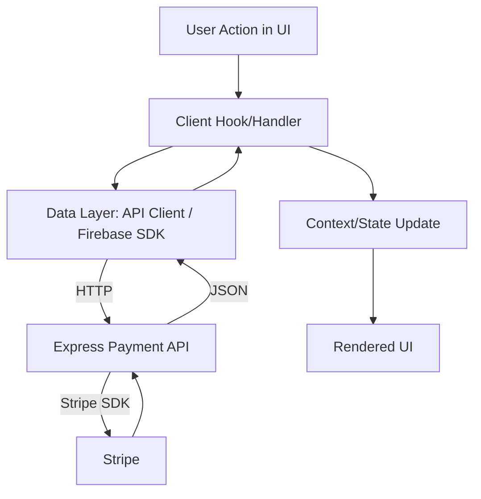
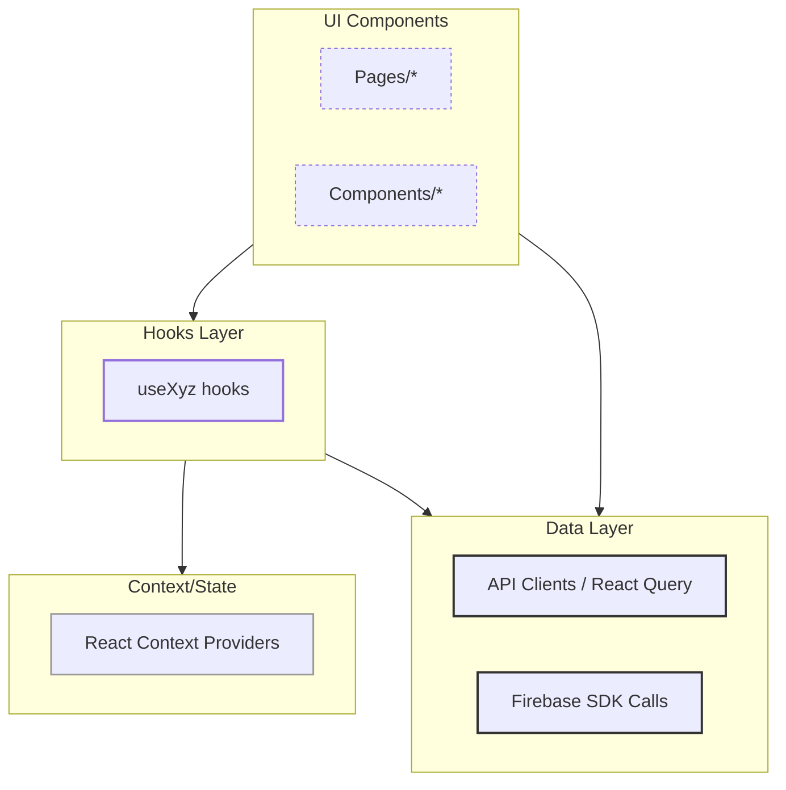
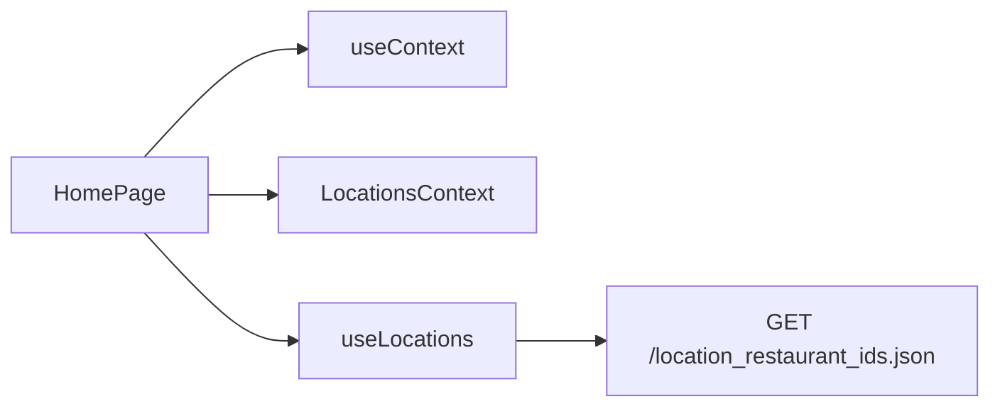
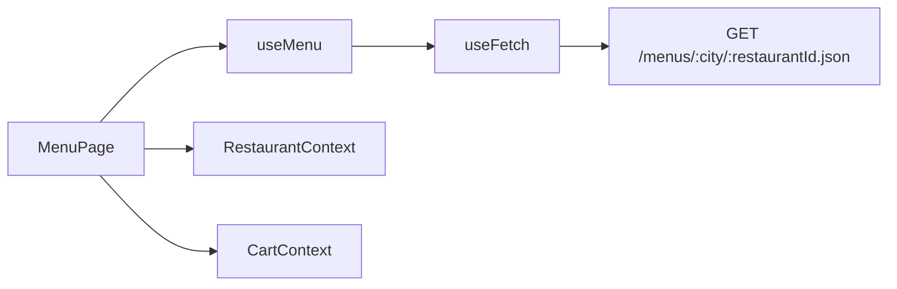
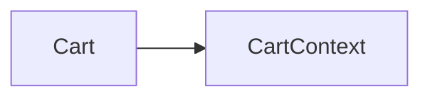
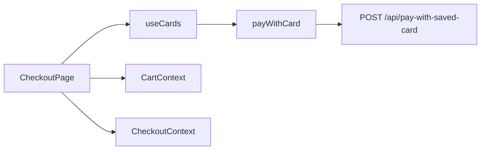
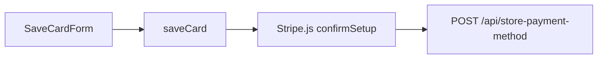
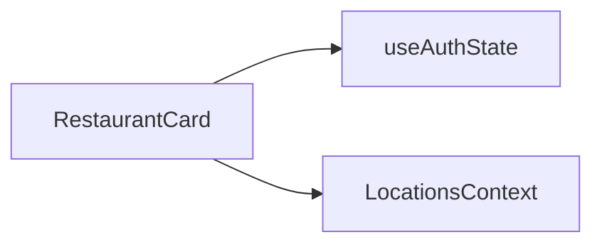
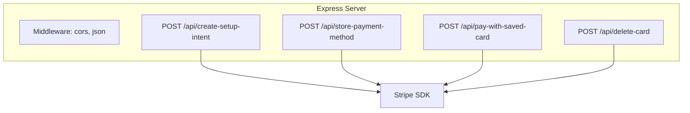
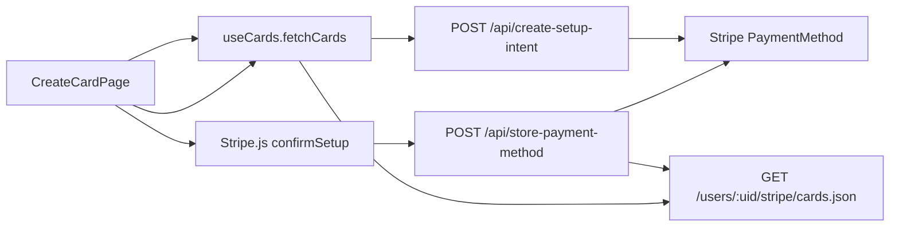

# HungerBox Architecture

## Project Overview

HungerBox is a modern food ordering web application. The frontend is built with React and Vite, featuring modular UI, context-based state management, and Firebase for authentication and data. The backend is an Express server that integrates with Stripe for secure card payments, storing card metadata in Firebase Realtime Database.

---

## Tech Stack

**Frontend**

- React 19
- Vite
- Tailwind CSS (with Shadcn UI components)
- React Router
- Firebase (Auth, Realtime Database)
- [`Stripe.js`](Stripe.js) (client-side)
- Context API
- Sonner (toast notifications)
- Axios

**Backend**

- Express 5
- Stripe SDK
- node-fetch
- dotenv
- CORS

---

## Dependencies

### Frontend (package.json)

| Package                 | Version  |
| ----------------------- | -------- |
| react                   | ^19.1.1  |
| react-dom               | ^19.1.1  |
| react-router-dom        | ^7.8.0   |
| firebase                | ^12.1.0  |
| @stripe/react-stripe-js | ^3.9.1   |
| @stripe/stripe-js       | ^7.8.0   |
| tailwindcss             | ^4.1.11  |
| clsx                    | ^2.1.1   |
| axios                   | ^1.11.0  |
| embla-carousel-react    | ^8.6.0   |
| lucide-react            | ^0.539.0 |
| sonner                  | ^2.0.7   |
| zod                     | ^4.0.17  |
| ...                     | ...      |

### Backend (HungerBoxPayment/package.json)

| Package    | Version |
| ---------- | ------- |
| express    | ^5.1.0  |
| stripe     | ^18.4.0 |
| node-fetch | ^3.3.2  |
| dotenv     | ^17.2.1 |
| cors       | ^2.8.5  |

---

## Environment/Config Keys

**Frontend:**

- VITE_API_KEY
- VITE_AUTH_DOMAIN
- VITE_DATABASE_URL
- VITE_PROJECT_ID
- VITE_STORAGE_BUCKET
- VITE_MESSAGING_SENDER_ID
- VITE_APP_ID
- VITE_STRIPE_PK
- VITE_PAYMENT_BACKEND

**Backend:**

- STRIPE_SECRET_KEY
- PORT

---

## Layered Architecture (Frontend)

### 1. UI Components

**Purpose:** Presentational components for all pages and reusable UI elements.

**Key Modules:**

- src/components/
- src/pages/

**Interaction:** Consumes context, hooks, and data layer for state and data.

---

### 2. Hooks Layer

**Purpose:** Encapsulate data fetching, business logic, and side effects.

**Key Modules:**

- src/hooks/useAddress.js
- src/hooks/useCards.js
- src/hooks/useFetch.js
- src/hooks/useLocations.js
- src/hooks/useMenu.js
- src/hooks/useRestaurants.js

**Interaction:** Used by UI components and contexts to fetch and mutate data.

---

### 3. State/Context

**Purpose:** Global state management for cart, checkout, location, restaurant, and settings.

**Key Modules:**

- src/context/CartContext.jsx
- src/context/CheckoutContext.jsx
- src/context/LocationContext.jsx
- src/context/RestaurantContext.jsx
- src/context/SettingsContext.jsx

**Interaction:** Provided at the app root, consumed by pages/components.

---

### 4. Data Layer

**Purpose:** API clients, Firebase SDK calls, [`Stripe.js`](Stripe.js) integration.

**Key Modules:**

- src/config/firebase.js
- src/hooks/useFetch.js
- src/hooks/useCards.js
- src/hooks/useAddress.js
- src/hooks/useMenu.js
- src/hooks/useRestaurants.js

**Interaction:** Called by hooks and contexts to fetch/update data.

---

### 5. Routing

**Purpose:** Route definitions and navigation.

**Key Modules:**

- src/App.jsx
- src/main.jsx

**Interaction:** Renders pages based on route, provides navigation.

---

### 6. Utilities

**Purpose:** Helper functions for classnames, merging styles, etc.

**Key Modules:**

- src/lib/utils.js

---

## Component → Layer Usage Map

| Component/Page  | Hooks        | Context                        | Data Layer              | Utils |
| --------------- | ------------ | ------------------------------ | ----------------------- | ----- |
| HomePage        | useContext   | LocationsContext               | useLocations            | cn    |
| MenuPage        | useMenu      | RestaurantContext, CartContext | useRestaurants, useMenu | cn    |
| Cart            | useContext   | CartContext                    | -                       | cn    |
| CheckoutPage    | useCards     | CartContext, CheckoutContext   | useCards, useAddress    | cn    |
| AddressBookPage | useAddress   | -                              | useAddress              | cn    |
| CardsListPage   | useCards     | -                              | useCards                | cn    |
| CreateCardPage  | useCards     | -                              | useCards                | cn    |
| LoginModal      | -            | -                              | src/config/firebase.js  | cn    |
| Header          | useAuthState | -                              | src/config/firebase.js  | cn    |
| Settings        | useContext   | SettingsContext                | -                       | cn    |

---

## Data Layer Inventory

### API Clients & Hooks

| Name                     | Method/Path                                       | External Service             | Called By                     |
| ------------------------ | ------------------------------------------------- | ---------------------------- | ----------------------------- |
| useFetch                 | Any                                               | REST (Firebase, Menus, etc.) | All hooks                     |
| useAddress.fetchAddress  | GET `/addresses/:uid.json?auth=...`               | Firebase REST                | AddressBookPage, CheckoutPage |
| useAddress.addAddress    | POST `/addresses/:uid.json?auth=...`              | Firebase REST                | AddressFormPage               |
| useAddress.editAddress   | PUT `/addresses/:uid/:addressId.json?auth=...`    | Firebase REST                | EditAddressFormPage           |
| useAddress.deleteAddress | DELETE `/addresses/:uid/:addressId.json?auth=...` | Firebase REST                | AddressBookPage               |
| useCards.startCardSave   | POST `/api/create-setup-intent`                   | Express backend              | CreateCardPage                |
| useCards.saveCard        | [`Stripe.js`](Stripe.js) confirmSetup             | Stripe                       | CreateCardPage                |
| useCards.deleteCard      | POST `/api/delete-card`                           | Express backend              | CardsListPage                 |
| useCards.fetchCards      | GET `/users/:uid/stripe/cards.json`               | Firebase REST                | CardsListPage, CheckoutPage   |
| useCards.payWithCard     | POST `/api/pay-with-saved-card`                   | Express backend              | CheckoutPage                  |
| useMenu.fetchMenus       | GET `/menus/:city/:restaurantId.json`             | Firebase REST                | MenuPage                      |
| useRestaurants           | GET `/locations/:city.json`                       | Firebase REST                | RestaurantContext             |

### Firebase SDK Calls

- src/config/firebase.js: Auth, DB initialization, sign-in/sign-out, sign-up, login.

---

## Backend (Express Payment API)

### Routes (HungerBoxPayment/index.js)

| Method | Path                        | Handler           | Stripe Usage           | Firebase Usage                                                          |
| ------ | --------------------------- | ----------------- | ---------------------- | ----------------------------------------------------------------------- |
| POST   | `/api/create-setup-intent`  | createSetupIntent | SetupIntent, Customer  | Read/write customerId to `/users/:uid/stripe/user.json`                 |
| POST   | `/api/store-payment-method` | storeCardMetadata | Retrieve PaymentMethod | Write card metadata to `/users/:uid/stripe/cards/:paymentMethodId.json` |
| POST   | `/api/pay-with-saved-card`  | payWithSavedCard  | PaymentIntent          | -                                                                       |
| POST   | `/api/delete-card`          | deleteCard        | Detach PaymentMethod   | Delete card from `/users/:uid/stripe/cards/:paymentMethodId.json`       |

**Middleware:**

- CORS
- express.json()
- dotenv.config()

**Error Handling:**

- All handlers return 500 with error message on failure.

**Config:**

- Reads Stripe secret key from env.

---

## Mermaid Flowcharts

### Top-level Request Flow

---

### Frontend Layers

---

### Per-component Dependency Mini-Graphs

#### HomePage

#### MenuPage

#### Cart

#### CheckoutPage

#### AddressBookPage

#### CardsListPage

#### CreateCardPage

#### SaveCardForm

#### RestaurantCard

#### Settings

---

### Backend Route Map

---

### Data Flow for "Save Card"

---

## Dependency Graph (Concise)

- CheckoutPage → useCards → payWithCard → POST /api/pay-with-saved-card
- CreateCardPage → useCards → startCardSave → POST /api/create-setup-intent
- SaveCardForm → useCards → saveCard → [`Stripe.js`](Stripe.js) confirmSetup → POST /api/store-payment-method
- CardsListPage → useCards → fetchCards → GET /users/:uid/stripe/cards.json
- AddressBookPage → useAddress → fetchAddress → GET /addresses/:uid.json
- MenuPage → useMenu → useFetch → GET /menus/:city/:restaurantId.json
- RestaurantContext → useRestaurants → useFetch → GET /locations/:city.json

---

## Conventions & Notes

- **State Management:** Context API for cart, location, restaurant, checkout, and settings.
- **Data Fetching:** Custom hooks with Axios for REST calls; Firebase SDK for auth.
- **Error/Loading:** Skeletons (e.g., RestaurantCardSkeleton), toast notifications via Sonner.
- **Dark Mode:** Managed via SettingsContext and toggled on `<body>`.
- **Routing:** Defined in App.jsx using React Router.
- **Validation:** Zod schemas for address forms (schemas.js).
- **Stripe Integration:** Client-side via Stripe.js, backend via Stripe SDK.

---

## Assumptions

- No React Query detected; all data fetching is via custom hooks.
- No webhooks or advanced Stripe flows in backend.
- All REST endpoints are Firebase Realtime Database or Express payment API.
- No persistent Redux or MobX store.

---